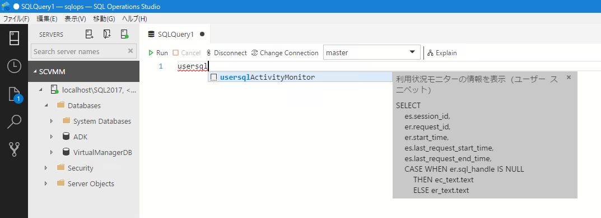

 %USERPROFILE%\AppData\Roaming\sqlops\User\snippets 内に「sql.json」を配置することで、ユーザースニペット登録されます。

追加方法の詳細については、次の情報を参照して下さい。
- [Create and use code snippets to quickly create Transact-SQL (T-SQL) scripts in SQL Operations Studio (preview)](https://docs.microsoft.com/en-us/sql/sql-operations-studio/code-snippets)

レポジトリ内のスニペットは「usersql」をプレフィックスとして設定していますので、必要に応じて JSON を変更してください。

スニペットを追加すると、クエリウィンドウにプレフィックスを入力することで、スニペットに登録したクエリを使用することが可能になります。

本リポジトリのスニペットでは、次のクエリが登録されています。
- 利用状況モニター
