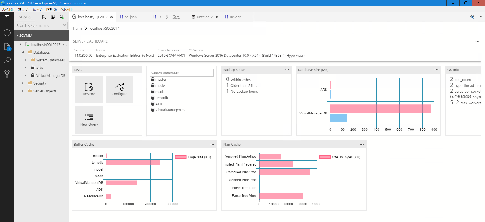

ウィジェットで利用する SQL のファイルを「sqlops.exe」の配下に「sql」ディレクトリを作成し、その配下にウィジェットで使用している SQL を配置します。  
ウィジェットは、SQL Operations Studio のユーザー定義内に設定しているため、「ファイル -> 基本設定 -> 設定」でユーザー定義を作成し、本リポジトリ内の Setting.json の定義を追加して下さい。

追加方法の詳細については、次の情報を参照して下さい。
- [Tutorial: Enable the table space usage sample insight widget using SQL Operations Studio (preview)](https://docs.microsoft.com/en-us/sql/sql-operations-studio/tutorial-qds-sql-server)
- [Tutorial: Add the five slowest queries sample widget to the database dashboard](https://docs.microsoft.com/en-us/sql/sql-operations-studio/tutorial-qds-sql-server)
- [Manage servers and databases with Insight widgets in SQL Operations Studio (preview)](https://docs.microsoft.com/en-us/sql/sql-operations-studio/insight-widgets)

ウィジェットを追加することで、自分で定義した情報をダッシュボードに表示することができます。

